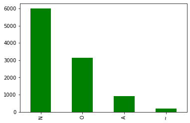
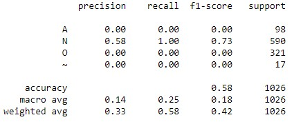
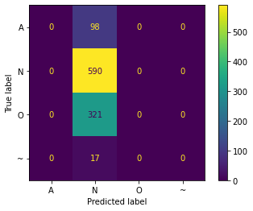
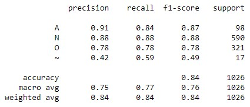
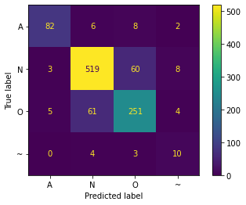
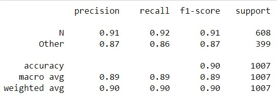
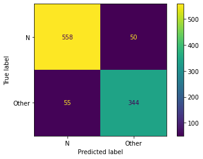

# Neural Networks
## Multi Layer Perceptron
**ECG signals** are classified into four classes: N for Normal, A for Atrial fibrillation, O for Others, and ~ for cases affected by unknown noise. 
The dataset used for classification is "[ECG.csv](https://github.com/fardinabbasi/Neural_Networks/blob/MLP/ECG.csv)" which contains 169 features.
### Data Exploration
The class distribution of the samples is as follows: N (Normal) - 5992 samples, O (Others) - 3151 samples, A (Atrial fibrillation) - 923 samples, and ~ (Affected with unknown noise) - 187 samples.



Indeed, the class distribution appears to be **highly imbalanced**.
### Preprocessing
The dataset has been divided into a **training set** and a **test set**. 
Additionally, the features have been normalized using **StandardScaler**.
### MLP Architecture
Here is the architecture of the MLP (Multi-Layer Perceptron) classifier:
```ruby
clf = MLPClassifier(hidden_layer_sizes=(128,64,32,16), activation='relu', solver='sgd', max_iter=1000, random_state=42)
```
### Comparing Performance with Normalized and Unnormalized Features
The model was fed with two different types of features: **normalized** features and **unnormalized** features. Below are the results for comparison:
| Features | Classification Report | Confusion Matrix |
| --- | --- | --- |
| Unnormalized |  |  |
| Normalized |  |  |

It is clear from the results that normalizing has quite an impressive impact on model performance. Normalization is a crucial preprocessing step because a feature with a higher range can **outweigh** a feature with a lower range. [Read More](https://sathish-manthani.medium.com/data-normalization-and-standardization-7ce8cb6472ae)
## Data Manipulation
To handle the imbalanced distribution of classes, the class ~, which has the lowest number of samples, is **omitted**, and the A and O classes are **merged** into an '**abnormal**' class.
| Classification Report | Confusion Matrix |
| --- | --- |
|  |  |

The results indicate a slight improvement in model performance.
## Course Description
- **Course**: Machine Learning [ECE 501]
- **Semester**: Spring 2023
- **Institution:** [School of Electrical & Computer Engineering](https://ece.ut.ac.ir/en/), [College of Engineering](https://eng.ut.ac.ir/en), [University of Tehran](https://ut.ac.ir/en)
- **Instructors:** Dr. A. Dehaqani, Dr. Tavassolipour